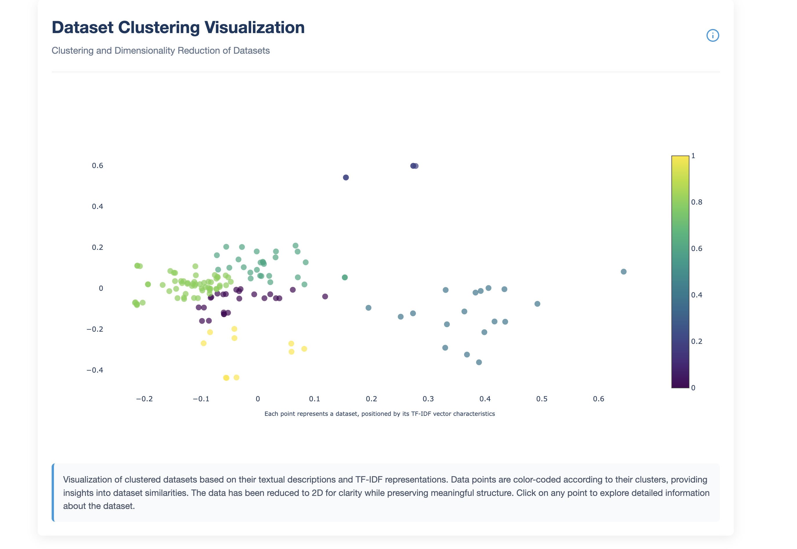
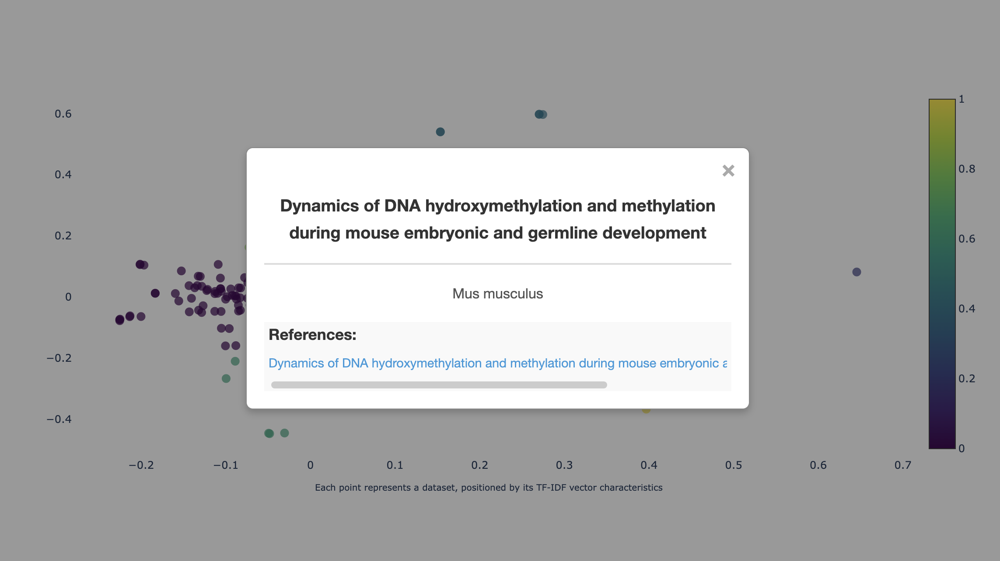

# Dataset Geo-Clustering Web Service

This project provides a web service that visualizes dataset clusters linked to scientific publications, using tf-idf for text processing and clustering of GEO datasets associated with PubMed IDs.

## Table of Contents
- [Project Overview](#project-overview)
- [Features](#features)
- [Installation Instructions](#installation-instructions)
- [Usage Instructions](#usage-instructions)
- [Development Mode](#development-mode)
- [Future Improvements](#future-improvements)
- [Adding New Data](#adding-new-data)
- [Screenshots](#screenshots)
- [License](#license)

## Project Overview
This Flask-based web service is designed to provide an interactive visualization of dataset clusters associated with scientific publications. Given a list of PubMed IDs (PMIDs), the service retrieves open datasets stored in the GEO database and constructs a vector representation of dataset descriptions using tf-idf. The goal is to compute similarities between datasets and visualize their clustering, along with their associations with PMIDs.

**Note**: Running the server might take some time because data fetching is limited by the number of API requests. To enhance performance, an API key should be added to the API configuration file, which currently supports it.
## Features

- **PMID to GEO dataset retrieval** using the e-utils API
- **Text processing with tf-idf** on key dataset fields
- **Dataset clustering** based on vector similarity
- **Interactive visualization** of dataset clusters and their PMID associations


## Installation Instructions
**Note**: Ensure you have Python 3.9 or above installed on your system.

1. Clone this repository to your local machine:
    ```bash
    git clone https://github.com/IgorAmi52/Geo-Cluster-Web.git
    ```
2. Navigate to the project directory:
    ```bash
    cd Geo-Cluster-Web
    ```
3. Install required dependencies:
    ```bash
    pip install -r requirements.txt
    ```

## Usage Instructions
1. Run the Flask web service:
    ```bash
    flask run
    ```
2. Open your browser and go to `http://localhost:5000` to access the web service.

## Development Mode
This project is currently in development mode and is designed to run locally on your machine. It is not yet deployed to a production environment. If you wish to contribute or make changes, you can:
- Modify any part of the codebase.
- Ensure your changes are properly tested.
- Push your changes back to the repository if required.

## Future Improvements

- **Enhanced similarity metrics**: Experiment with alternative NLP techniques like word embeddings (Word2Vec, BERT) to improve dataset similarity computation.
- **Advanced clustering methods**: Implement alternative clustering algorithms (e.g., hierarchical clustering, DBSCAN) for better grouping of datasets.
- **User-defined filtering**: Allow users to filter results based on metadata such as organism type, experiment category, or publication date.
- **Integration with additional databases**: Extend support to other biological or medical databases to enrich dataset associations.
- **Real-time updates**: Implement a caching mechanism or scheduled updates to keep dataset associations up to date.

## Adding New Data
To use this web service with a different dataset, follow these steps:
1. Import the dataset into the `data/` directory.
2. Create a new configuration file for your dataset in the `config/data` directory. Ensure the new config file is compatible with the data structure and includes appropriate settings.
3. Update the `config.py` file to import the new configuration file.
4. Ensure that the dataset follows the expected format.

## Screenshots
Below are some example screenshots of the application in use:

1. **Dataset Clusters** - Visual representation of clustered dataset points:
   
   
2. **Dataset Insights** - Modal showing selected dataset details:
   

## License
This project is licensed under the MIT License.
